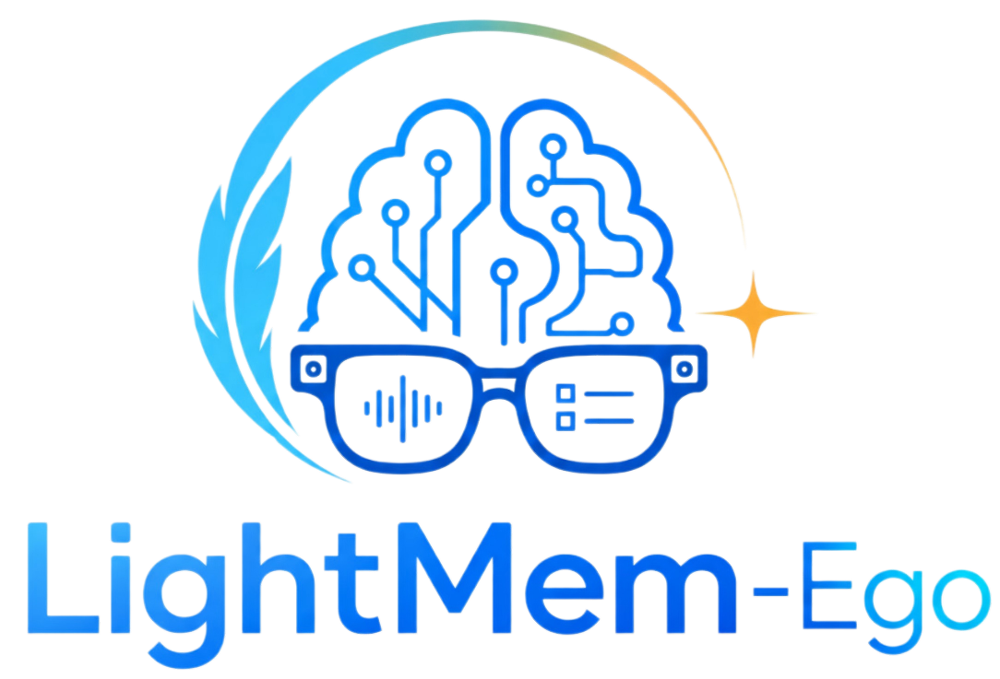
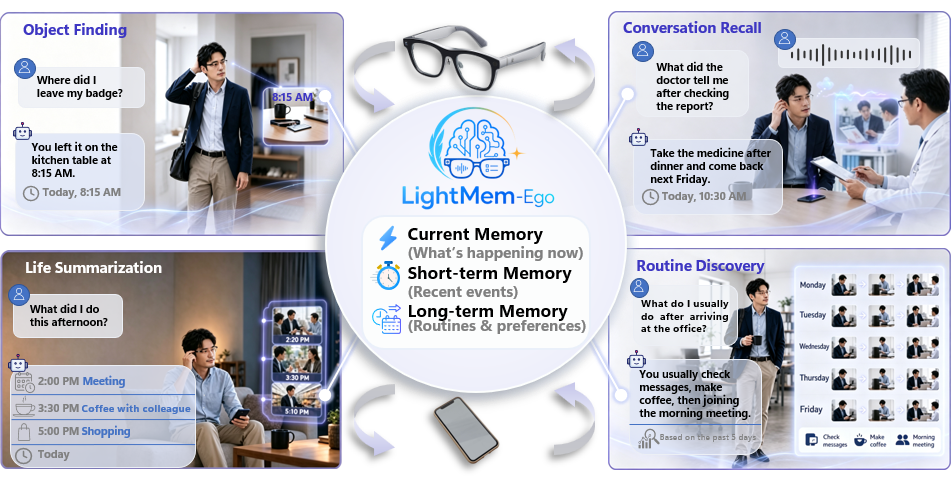
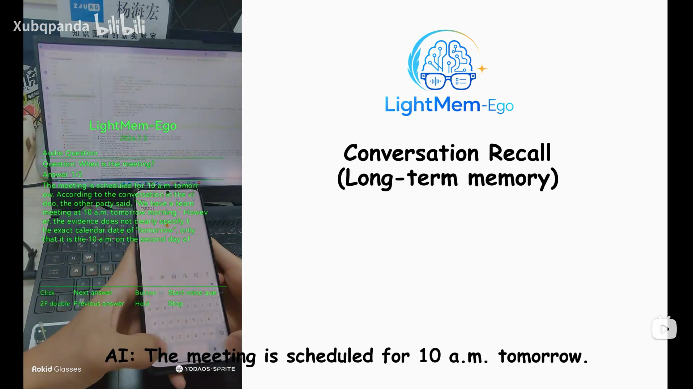

<div align="center">
  
</div>

<h1 align="center">LightMem-Ego: Your AI Memory for Everyday Life</h1>

<p align="center">
  <b>A streaming multimodal memory system for smart glasses, web capture, and everyday-life question answering.</b>
</p>

<p align="center">
  <a href="https://arxiv.org/abs/2607.11487">
    
  </a>
  <a href="https://huggingface.co/papers/2607.11487">
    
  </a>
  <a href="https://github.com/zjunlp/LightMem-Ego">
    
  </a>
  <a href="https://github.com/zjunlp/LightMem-Ego/blob/main/LICENSE">
    
  </a>
  
  
</p>

<p align="center">
  <a href="#overview">Overview</a> |
  <a href="#demo">Demo</a> |
  <a href="#system-design">System Design</a> |
  <a href="#quick-start">Quick Start</a> |
  <a href="#repository-layout">Repository Layout</a> |
  <a href="#text-only-benchmark-api">Text API</a> |
  <a href="#related-works">Related Works</a> |
  <a href="#privacy-notice">Privacy</a>
</p>

---

<span id="overview"></span>

## Overview

**LightMem-Ego** is an end-to-end egocentric memory system for everyday-life assistance. It connects a Rokid AI Glass Android app, a browser frontend, and an online backend service so users can stream first-person camera/audio context, build structured memory from daily experience, and ask questions about current or past moments.

The system organizes continuous visual-audio experience into three memory scopes:

- **Current memory** for ongoing scene understanding.
- **Short-term memory** for recent events, actions, and conversations.
- **Long-term memory** for consolidated episodes, routines, preferences, and semantic facts.

LightMem-Ego is designed for practical scenarios such as object finding, conversation recall, life summarization, routine discovery, and hands-free wearable assistance.

<div align="center">
  
</div>

---

<span id="highlights"></span>

## Highlights

- **Streaming egocentric capture**: captures first-person visual frames and microphone audio from smart glasses or the browser.
- **Timeline-aligned multimodal memory**: aligns frames, audio chunks, transcripts, and metadata on a shared session timeline.
- **Hierarchical memory organization**: maintains current, short-term, and long-term memory for different temporal scopes.
- **Memory-grounded question answering**: retrieves timestamped multimodal evidence before generating answers.
- **Glasses + web deployment**: supports a Rokid AI Glass app for hands-free interaction and a browser frontend for desktop/mobile use.
- **Modular backend**: separates stream ingestion, session management, memory construction, retrieval, and QA workers.

---

<span id="demo"></span>

## Demo

Demo video: [YouTube](https://www.youtube.com/watch?v=BZuIxn00xlc) · [Bilibili](https://www.bilibili.com/video/BV1oANw62EA3/?vd_source=2537e8437f33dacc6255c196ac8292c3)

<p align="center">
  <a href="https://www.bilibili.com/video/BV1oANw62EA3/">
    
  </a>
</p>

<p align="center">
  <a href="https://www.bilibili.com/video/BV1oANw62EA3/">
    Watch the full demo video
  </a>
</p>

---

<span id="system-design"></span>

## System Design

LightMem-Ego is organized as three cooperating components:

1. **AI Glass App**
   Captures first-person camera frames and microphone audio, controls live sessions, submits voice questions, and displays memory-grounded answers on the glasses.

2. **Backend Service**
   Receives live streams, manages sessions, builds current/short-term/long-term memories, retrieves evidence, and returns answers.

3. **Web Frontend**
   Provides a browser interface for live capture, memory interaction, session review, and backend-powered QA.

```text
Web frontend         \
                     -> Backend API and workers -> Memory / retrieval / QA
Rokid AI Glass app  /
```

At runtime, either the web frontend or the glasses app can open a live session with the backend, send visual/audio data, and receive memory-grounded answers.

---

<span id="repository-layout"></span>

## Repository Layout

```text
src/
  frontend/       # Vite + React web frontend
  backend/        # FastAPI service, online workers, and memory-processing logic
  ai_glass_app/   # Rokid AI Glass Android app
```

Component documentation:

- [`src/frontend/README.md`](src/frontend/README.md)
- [`src/backend/README.md`](src/backend/README.md)
- [`src/ai_glass_app/README.md`](src/ai_glass_app/README.md)

---

<span id="components"></span>

## Components

### `src/frontend/`

The web frontend is a Vite + React app. It supports browser camera/microphone capture, session start/stop, live ingest controls, question submission, answer display, and evidence review.

The API base URL is configured with `VITE_API_BASE_URL` at build time, with a production fallback in `online_web/src/api/lightmem_egoApi.js`.

### `src/backend/`

The backend is a FastAPI-based online server. It exposes stream and query APIs, manages live sessions, runs workers for preprocessing/ASR/memory updates, and serves memory-grounded answers.

The backend uses the `src/em2mem/` runtime package for memory, LLM, and embedding components. Runtime sessions, logs, model weights, generated indexes, and private `.env` files are intentionally excluded.

### `src/ai_glass_app/`

The glasses app is an Android client for Rokid AI Glass. It starts and stops live capture, streams camera/audio data, records short voice questions, and renders answers on a glasses-friendly UI.

The backend endpoint is configured in:

```text
src/ai_glass_app/app/src/main/java/cn/zjukg/lightmem/glass/lightmem_ego/LightMemEgoConfig.kt
```

---

<span id="quick-start"></span>

## Quick Start

Each component has its own setup and runtime requirements. Start with the README for the component you want to run.

### Frontend

```bash
cd src/frontend/online_web
npm install
npm run dev
```

For production build:

```bash
npm run build
```

### Backend

```bash
cd src/backend
python -m venv .venv
source .venv/bin/activate
python -m pip install --upgrade pip
python -m pip install -e .
cp .env.example .env
scripts/start_api.sh
```

Start the default online worker set:

```bash
scripts/start_online_all_workers.sh
```

### Glasses App

Windows:

```powershell
cd src\ai_glass_app
.\gradlew.bat assembleDebug
```

macOS or Linux:

```bash
cd src/ai_glass_app
./gradlew assembleDebug
```

---

<span id="scenarios"></span>

## Supported Scenarios

| Scenario | Example Query | Memory Scope |
| :--- | :--- | :--- |
| **Object Finding** | "Where did I leave my badge?" | Current / short-term memory |
| **Conversation Recall** | "What did the doctor tell me after checking the report?" | Short-term memory + transcript context |
| **Life Summarization** | "What did I do this afternoon?" | Short-term and long-term memory |
| **Routine Discovery** | "What do I usually do after arriving at the office?" | Long-term semantic memory |
| **Wearable Assistance** | "What am I looking at now?" | Current memory |

---


<span id="text-only-benchmark-api"></span>

## Text-Only Benchmark API

This repository adds a benchmark-oriented **LightMem-Ego text-only method ablation** alongside the official wearable pipeline. It is not a plain vector-database wrapper: it preserves the `M_st` / `M_lt` hierarchy and reuses LightMem-Ego's routing, short-term retrieval, EM2Mem artifact layout, and evidence fusion, while replacing multimodal memory construction with a deterministic text adapter.

### Upstream provenance

The server source was originally copied from the [official LightMem-Ego repository](https://github.com/zjunlp/LightMem-Ego) without its upstream `.git` directory. Therefore, the exact historical fork commit cannot be recovered honestly. The implementation was rechecked against official `main` at [`b6aa0f7`](https://github.com/zjunlp/LightMem-Ego/tree/b6aa0f719d95acfc3d92ebe338bf31fcf97bfd10) on 2026-08-13; that commit is a comparison reference, **not** a claimed fork base. The description below is scoped to the text-only service and does not claim that every copied file is byte-for-byte identical to current upstream.

### What was added

| File | Change on top of LightMem-Ego |
| :--- | :--- |
| `src/backend/lightmem_text_memory_api_server.py` | New standalone `/add`, `/search`, and `/health` benchmark service plus the text-to-LightMem adapter. |
| `src/backend/text_embedding_server.py` | New local OpenAI-compatible SentenceTransformers embedding endpoint. |
| `src/backend/scripts/start_lightmem_text_memory_api.sh` / `stop_lightmem_text_memory_api.sh` | Start and stop the text memory service on port `8767`. |
| `src/backend/scripts/start_text_embedding_server.sh` / `stop_text_embedding_server.sh` | Start and stop the embedding endpoint on port `8010`, using GPU 4 by default. |
| `src/backend/scripts/smoke_lightmem_text_api.sh` | Minimal health, add, and search integration test. |
| `src/backend/docs/lightmem_text_ablation.md` | Detailed API, memory construction, retrieval, deployment, and ablation notes. |

The text service is a separate entrypoint. It does not require the glasses app, web capture, the official `api_server.py`, or the online media workers, and it does not replace those components.

### Official pipeline versus this text ablation

| Stage | Official multimodal LightMem-Ego | This repository's text-only implementation |
| :--- | :--- | :--- |
| Input | Glasses/browser frames and audio, followed by preprocessing, ASR, and VLM captioning. | `/add` accepts timestamped `user`, `assistant`, `system`, or `tool` text messages. |
| Current memory (`M_cur`) | Maintains current visual context for questions about the live scene. | Disabled; all current-memory and image-evidence flags are forced off. |
| Short-term construction (`M_st`) | Builds micro-events from stream boundaries, aligned transcripts, keyframes, actions, and visual changes. | Converts each message into one timestamped pseudo micro-event. The raw text becomes its transcript and `"{role}: {content}"` becomes its caption; keyframes and visual fields remain empty. |
| Short-term storage/retrieval | Uses `MSTStore`, the LightMem micro-event schema, and `MSTRetriever`. | Reuses those same repository modules. Active and archive windows are enlarged so benchmark records are not evicted during a run. |
| Long-term construction (`M_lt`) | Consolidates multimodal episodes into EM2Mem captions, episodic sidecars, semantic memory, and visual evidence. | Starts from text-only `M_st`; one message produces one base episode in the 30-second artifact format, then the existing EM2Mem writers build 30s / 3min / 10min / 1h captions and sidecars. Semantic facts/triplets use the deterministic `rule` backend; visual evidence is an empty list. |
| Routing and planning | `MemoryRouter` and `RetrievalPlanner` select `M_cur`, `M_st`, `M_lt`, text, and visual evidence according to query and runtime state. | Reuses `MemoryRouter` and `RetrievalPlanner`, then constrains the plan to `retrieval_mode=text_only`, disables `M_cur`/images, and keeps available `M_st` and `M_lt` searchable. |
| Long-term retrieval | Can use the full EM2Mem text/semantic/visual retrieval stack. | Adapter-specific text retrieval loads multiscale captions and semantic facts, prefilters them lexically, embeds the reduced candidate set, and ranks by dense, lexical, source-scale, graph, and recency signals. |
| Fusion | `MemoryFusion` combines evidence selected from the memory hierarchy. | Reuses `MemoryFusion` to combine native `M_st` results with text-only `M_lt` results. |
| Output | The full query pipeline may generate a final memory-grounded answer with multimodal evidence. | `/search` returns ranked evidence only as `id`, `content`, `score`, and `created_at`; the benchmark harness performs any downstream answering/scoring. |

"Reuses" above means that the adapter imports and calls the pre-existing LightMem-Ego modules in this source tree rather than reimplementing their responsibilities. It does not mean every local module is identical to the latest official `main`.

### Exact write path

```text
POST /add
  -> validate request_id, user_id, session_id, role, timestamp, and content
  -> keep content unchanged as raw_content
  -> create stable memory metadata and an embedding input containing scope/role/time
  -> persist the raw record and embedding in SQLite
  -> during /search (default lazy build), or immediately when LIGHTMEM_TEXT_BUILD_ON_ADD=1:
       message -> text M_st micro-event -> base episode/evidence document
       -> EM2Mem 30s/3min/10min/1h captions
       -> episodic sidecars + rule-based semantic facts
```

No LLM rewrites the incoming message. The adapter adds metadata only to `display_content` and `searchable_content`. A `request_id` should be globally unique within one deployment because it is used for idempotent upsert together with the message index.

Memory artifacts are isolated by a stable hash of `user_id + session_id` when `/search` includes `session_id`. Omitting `session_id` intentionally selects all records under the user for backward compatibility. Artifact construction uses a full scope rebuild rather than the official streaming worker's incremental media pipeline; by default the build is triggered lazily so `/add` stays fast.

### Exact search path

```text
POST /search
  -> select records by user_id + optional session_id
  -> ensure text-only M_st and M_lt artifacts exist
  -> MemoryRouter
  -> RetrievalPlanner, constrained to text_only with M_cur/images disabled
  -> MSTRetriever over active + archived text micro-events
  -> multiscale M_lt caption/semantic retrieval
  -> MemoryFusion
  -> deduplicated top_k benchmark evidence
```

For long-term candidates, the adapter first applies a bounded lexical/graph/source/recency prefilter and then scores the remaining texts as:

```text
0.46 * dense_embedding
+ 0.28 * lexical_overlap
+ 0.12 * source_scale_bonus
+ 0.08 * semantic_triplet_overlap
+ 0.06 * relative_recency
```

This long-term scorer is a text-only adaptation, not an unchanged call to the official multimodal retriever. The default embedding model is `all-MiniLM-L6-v2` served locally on GPU 4; this is also a deployment substitution, not the paper's visual embedding path. If method-level retrieval raises an exception or produces no evidence, the service falls back to raw SQLite text retrieval using dense and lexical similarity so the HTTP contract remains available. `/health` exposes the selected embedding backend and the latest method error.

By default, multiple-choice `options` are appended to the retrieval query. Set `LIGHTMEM_TEXT_INCLUDE_OPTIONS_IN_QUERY=0` for query-only retrieval and report this setting in benchmark results.

### Method fidelity boundary

The retained methodological core is hierarchical `M_st + M_lt` memory, multiscale long-term artifacts, query-dependent routing/planning, separate short-/long-term retrieval, and evidence fusion. The deliberate ablation differences are direct text ingestion, no `M_cur`, no media/ASR/VLM/visual evidence, rule-based consolidation metadata, a local text embedding model, full-scope lazy rebuilds, and ranked-evidence output without final answer generation. Results from this service should therefore be reported as **LightMem-Ego text-only ablation**, not as the full multimodal LightMem-Ego system.

Start the local text embedding service and API:

```bash
cd src/backend
scripts/start_text_embedding_server.sh
scripts/start_lightmem_text_memory_api.sh
```

Default endpoint:

```text
http://127.0.0.1:8767
```

Benchmark contracts:

```bash
curl -X POST http://127.0.0.1:8767/add \
  -H 'Content-Type: application/json' \
  -d '{
    "request_id":"req-1",
    "user_id":"user-1",
    "session_id":"session-1",
    "messages":[{"role":"user","timestamp":1704067200000,"content":"raw memory text"}]
  }'

curl -X POST http://127.0.0.1:8767/search \
  -H 'Content-Type: application/json' \
  -d '{
    "query":"question",
    "options":["A. ...","B. ..."],
    "user_id":"user-1",
    "session_id":"session-1",
    "top_k":10
  }'
```

`session_id` in `/search` is optional for backward compatibility. When provided, retrieval is isolated to memories added with the same `user_id + session_id`; when omitted, retrieval uses all memories under the user.

More details are in [`src/backend/docs/lightmem_text_ablation.md`](src/backend/docs/lightmem_text_ablation.md).

---

<span id="related-works"></span>

## Related Works
This repository belongs to ZJUNLP LightMem series, focusing on solving context bloat, excessive token consumption and low cache utilization for long-running LLM agents:
- [LightMem](https://github.com/zjunlp/LightMem) — A lightweight and efficient memory management framework designed for Large Language Models and AI Agents
- [LightMem2](https://github.com/zjunlp/LightMem2) — A modular framework for long-running agent memory and context management
- [LightMem-Ego](https://github.com/zjunlp/LightMem-Ego) — A lightweight streaming multimodal memory system for everyday-life assistance

<span id="privacy-notice"></span>

## Privacy Notice

LightMem-Ego may process camera frames, microphone audio, transcripts, generated answers, and memory data depending on deployment configuration. Before deploying with real users, review endpoint configuration, data retention policy, access control, and user consent flow.

This repository is intended for research and demonstration. Production deployments should implement privacy-preserving capture, sensitive-content filtering, encrypted storage, access control, retention/deletion policies, and user-controlled memory editing.

---

<span id="license"></span>

## License

See [`LICENSE`](LICENSE).

---

<span id="citation"></span>

## Citation

Paper and citation information will be added when available.

---

<span id="acknowledgements"></span>

## Acknowledgements

LightMem-Ego builds on the broader line of work on memory-augmented agents, egocentric multimodal understanding, and wearable AI assistants. We thank all contributors and collaborators who helped develop the system.
